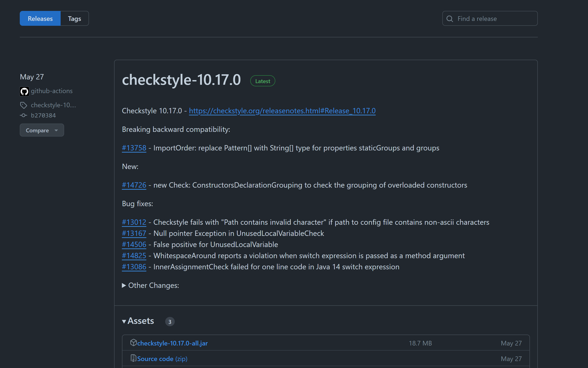
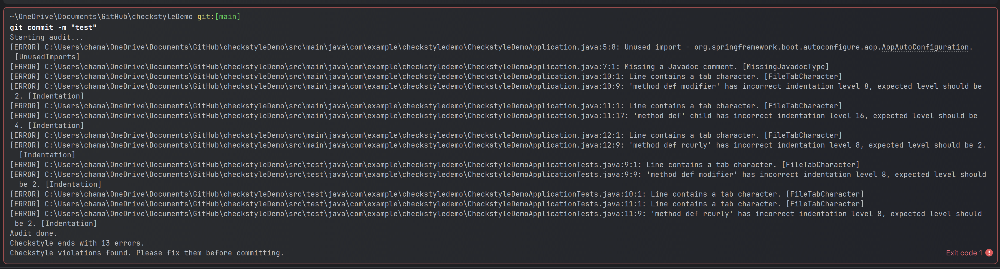
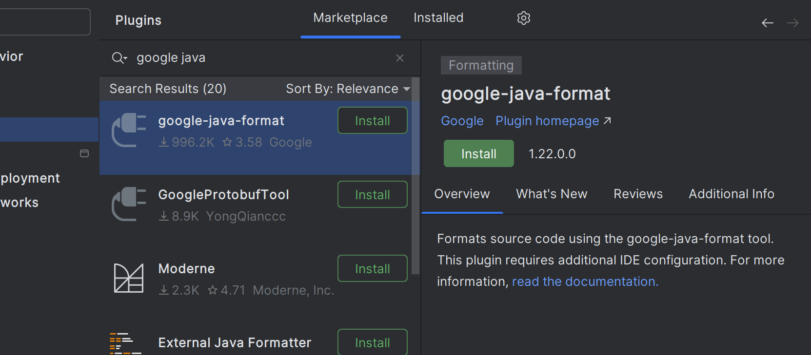
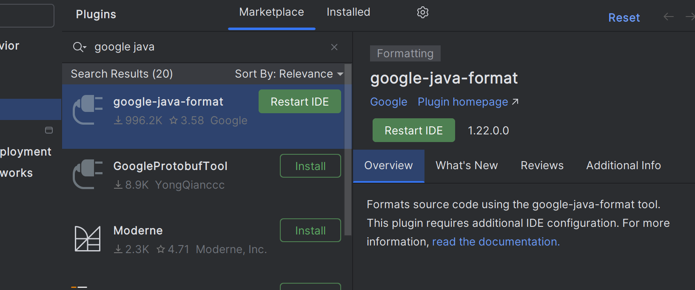
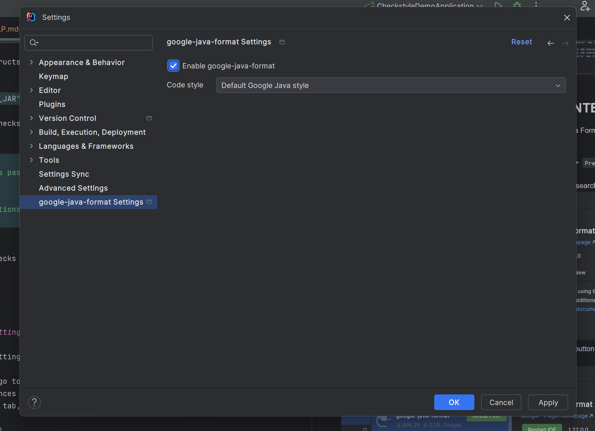

# Getting Started

## How To Add Check Style to Your Project

To add Checkstyle to your project, you need to follow these steps:

1. Download the latest version of Checkstyle from GitHub releases: [Checkstyle Releases](https://github.com/checkstyle/checkstyle/releases)

    

    download the latest version of the checkstyle jar file.

2. create a folder name checkstyle in the root of your project and paste the downloaded jar file in it.
3. Create a checkstyle.xml file in the checkstyle folder and paste the following code in it:

    this is the official google checkstyle configuration file.
    
    ```xml
    <?xml version="1.0"?>
    <!DOCTYPE module PUBLIC
            "-//Checkstyle//DTD Checkstyle Configuration 1.3//EN"
            "https://checkstyle.org/dtds/configuration_1_3.dtd">
    
    <!--
        Checkstyle configuration that checks the Google coding conventions from Google Java Style
        that can be found at https://google.github.io/styleguide/javaguide.html
    
        Checkstyle is very configurable. Be sure to read the documentation at
        http://checkstyle.org (or in your downloaded distribution).
    
        To completely disable a check, just comment it out or delete it from the file.
        To suppress certain violations please review suppression filters.
    
        Authors: Max Vetrenko, Ruslan Diachenko, Roman Ivanov.
     -->
    
    <module name = "Checker">
        <property name="charset" value="UTF-8"/>
    
        <property name="severity" value="error"/>
    
        <property name="fileExtensions" value="java, properties, xml"/>
        <!-- Excludes all 'module-info.java' files              -->
        <!-- See https://checkstyle.org/config_filefilters.html -->
        <module name="BeforeExecutionExclusionFileFilter">
            <property name="fileNamePattern" value="module\-info\.java$"/>
        </module>
        <!-- https://checkstyle.org/config_filters.html#SuppressionFilter -->
        <module name="SuppressionFilter">
            <property name="file" value="${org.checkstyle.google.suppressionfilter.config}"
                      default="checkstyle-suppressions.xml" />
            <property name="optional" value="true"/>
        </module>
    
        <!-- Checks for whitespace                               -->
        <!-- See http://checkstyle.org/config_whitespace.html -->
        <module name="FileTabCharacter">
            <property name="eachLine" value="true"/>
        </module>
    
        <module name="LineLength">
            <property name="fileExtensions" value="java"/>
            <property name="max" value="100"/>
            <property name="ignorePattern" value="^package.*|^import.*|a href|href|http://|https://|ftp://"/>
        </module>
    
        <module name="TreeWalker">
            <module name="UnusedImports"/>
            <module name="OuterTypeFilename"/>
            <module name="IllegalTokenText">
                <property name="tokens" value="STRING_LITERAL, CHAR_LITERAL"/>
                <property name="format"
                          value="\\u00(09|0(a|A)|0(c|C)|0(d|D)|22|27|5(C|c))|\\(0(10|11|12|14|15|42|47)|134)"/>
                <property name="message"
                          value="Consider using special escape sequence instead of octal value or Unicode escaped value."/>
            </module>
            <module name="AvoidEscapedUnicodeCharacters">
                <property name="allowEscapesForControlCharacters" value="true"/>
                <property name="allowByTailComment" value="true"/>
                <property name="allowNonPrintableEscapes" value="true"/>
            </module>
            <module name="AvoidStarImport"/>
            <module name="OneTopLevelClass"/>
            <module name="NoLineWrap">
                <property name="tokens" value="PACKAGE_DEF, IMPORT, STATIC_IMPORT"/>
            </module>
            <module name="EmptyBlock">
                <property name="option" value="TEXT"/>
                <property name="tokens"
                          value="LITERAL_TRY, LITERAL_FINALLY, LITERAL_IF, LITERAL_ELSE, LITERAL_SWITCH"/>
            </module>
            <module name="NeedBraces">
                <property name="tokens"
                          value="LITERAL_DO, LITERAL_ELSE, LITERAL_FOR, LITERAL_IF, LITERAL_WHILE"/>
            </module>
            <module name="LeftCurly">
                <property name="tokens"
                          value="ANNOTATION_DEF, CLASS_DEF, CTOR_DEF, ENUM_CONSTANT_DEF, ENUM_DEF,
                        INTERFACE_DEF, LAMBDA, LITERAL_CASE, LITERAL_CATCH, LITERAL_DEFAULT,
                        LITERAL_DO, LITERAL_ELSE, LITERAL_FINALLY, LITERAL_FOR, LITERAL_IF,
                        LITERAL_SWITCH, LITERAL_SYNCHRONIZED, LITERAL_TRY, LITERAL_WHILE, METHOD_DEF,
                        OBJBLOCK, STATIC_INIT, RECORD_DEF, COMPACT_CTOR_DEF"/>
            </module>
            <module name="RightCurly">
                <property name="id" value="RightCurlySame"/>
                <property name="tokens"
                          value="LITERAL_TRY, LITERAL_CATCH, LITERAL_FINALLY, LITERAL_IF, LITERAL_ELSE,
                        LITERAL_DO"/>
            </module>
            <module name="RightCurly">
                <property name="id" value="RightCurlyAlone"/>
                <property name="option" value="alone"/>
                <property name="tokens"
                          value="CLASS_DEF, METHOD_DEF, CTOR_DEF, LITERAL_FOR, LITERAL_WHILE, STATIC_INIT,
                        INSTANCE_INIT, ANNOTATION_DEF, ENUM_DEF, INTERFACE_DEF, RECORD_DEF,
                        COMPACT_CTOR_DEF"/>
            </module>
            <module name="SuppressionXpathSingleFilter">
                <!-- suppresion is required till https://github.com/checkstyle/checkstyle/issues/7541 -->
                <property name="id" value="RightCurlyAlone"/>
                <property name="query" value="//RCURLY[parent::SLIST[count(./*)=1]
                                         or preceding-sibling::*[last()][self::LCURLY]]"/>
            </module>
            <module name="WhitespaceAfter">
                <property name="tokens"
                          value="COMMA, SEMI, TYPECAST, LITERAL_IF, LITERAL_ELSE,
                        LITERAL_WHILE, LITERAL_DO, LITERAL_FOR, DO_WHILE"/>
            </module>
            <module name="WhitespaceAround">
                <property name="allowEmptyConstructors" value="true"/>
                <property name="allowEmptyLambdas" value="true"/>
                <property name="allowEmptyMethods" value="true"/>
                <property name="allowEmptyTypes" value="true"/>
                <property name="allowEmptyLoops" value="true"/>
                <property name="ignoreEnhancedForColon" value="false"/>
                <property name="tokens"
                          value="ASSIGN, BAND, BAND_ASSIGN, BOR, BOR_ASSIGN, BSR, BSR_ASSIGN, BXOR,
                        BXOR_ASSIGN, COLON, DIV, DIV_ASSIGN, DO_WHILE, EQUAL, GE, GT, LAMBDA, LAND,
                        LCURLY, LE, LITERAL_CATCH, LITERAL_DO, LITERAL_ELSE, LITERAL_FINALLY,
                        LITERAL_FOR, LITERAL_IF, LITERAL_RETURN, LITERAL_SWITCH, LITERAL_SYNCHRONIZED,
                        LITERAL_TRY, LITERAL_WHILE, LOR, LT, MINUS, MINUS_ASSIGN, MOD, MOD_ASSIGN,
                        NOT_EQUAL, PLUS, PLUS_ASSIGN, QUESTION, RCURLY, SL, SLIST, SL_ASSIGN, SR,
                        SR_ASSIGN, STAR, STAR_ASSIGN, LITERAL_ASSERT, TYPE_EXTENSION_AND"/>
                <message key="ws.notFollowed"
                         value="WhitespaceAround: ''{0}'' is not followed by whitespace. Empty blocks may only be represented as '{}' when not part of a multi-block statement (4.1.3)"/>
                <message key="ws.notPreceded"
                         value="WhitespaceAround: ''{0}'' is not preceded with whitespace."/>
            </module>
            <module name="OneStatementPerLine"/>
            <module name="MultipleVariableDeclarations"/>
            <module name="ArrayTypeStyle"/>
            <module name="MissingSwitchDefault"/>
            <module name="FallThrough"/>
            <module name="UpperEll"/>
            <module name="ModifierOrder"/>
            <module name="EmptyLineSeparator">
                <property name="tokens"
                          value="PACKAGE_DEF, IMPORT, STATIC_IMPORT, CLASS_DEF, INTERFACE_DEF, ENUM_DEF,
                        STATIC_INIT, INSTANCE_INIT, METHOD_DEF, CTOR_DEF, VARIABLE_DEF, RECORD_DEF,
                        COMPACT_CTOR_DEF"/>
                <property name="allowNoEmptyLineBetweenFields" value="true"/>
            </module>
            <module name="SeparatorWrap">
                <property name="id" value="SeparatorWrapDot"/>
                <property name="tokens" value="DOT"/>
                <property name="option" value="nl"/>
            </module>
            <module name="SeparatorWrap">
                <property name="id" value="SeparatorWrapComma"/>
                <property name="tokens" value="COMMA"/>
                <property name="option" value="EOL"/>
            </module>
            <module name="SeparatorWrap">
                <!-- ELLIPSIS is EOL until https://github.com/google/styleguide/issues/259 -->
                <property name="id" value="SeparatorWrapEllipsis"/>
                <property name="tokens" value="ELLIPSIS"/>
                <property name="option" value="EOL"/>
            </module>
            <module name="SeparatorWrap">
                <!-- ARRAY_DECLARATOR is EOL until https://github.com/google/styleguide/issues/258 -->
                <property name="id" value="SeparatorWrapArrayDeclarator"/>
                <property name="tokens" value="ARRAY_DECLARATOR"/>
                <property name="option" value="EOL"/>
            </module>
            <module name="SeparatorWrap">
                <property name="id" value="SeparatorWrapMethodRef"/>
                <property name="tokens" value="METHOD_REF"/>
                <property name="option" value="nl"/>
            </module>
            <module name="PackageName">
                <property name="format" value="^[a-z]+(\.[a-z][a-z0-9]*)*$"/>
                <message key="name.invalidPattern"
                         value="Package name ''{0}'' must match pattern ''{1}''."/>
            </module>
            <module name="TypeName">
                <property name="tokens" value="CLASS_DEF, INTERFACE_DEF, ENUM_DEF,
                        ANNOTATION_DEF, RECORD_DEF"/>
                <message key="name.invalidPattern"
                         value="Type name ''{0}'' must match pattern ''{1}''."/>
            </module>
            <module name="MemberName">
                <property name="format" value="^[a-z][a-z0-9][a-zA-Z0-9]*$"/>
                <message key="name.invalidPattern"
                         value="Member name ''{0}'' must match pattern ''{1}''."/>
            </module>
            <module name="ParameterName">
                <property name="format" value="^[a-z]([a-z0-9][a-zA-Z0-9]*)?$"/>
                <message key="name.invalidPattern"
                         value="Parameter name ''{0}'' must match pattern ''{1}''."/>
            </module>
            <module name="LambdaParameterName">
                <property name="format" value="^[a-z]([a-z0-9][a-zA-Z0-9]*)?$"/>
                <message key="name.invalidPattern"
                         value="Lambda parameter name ''{0}'' must match pattern ''{1}''."/>
            </module>
            <module name="CatchParameterName">
                <property name="format" value="^[a-z]([a-z0-9][a-zA-Z0-9]*)?$"/>
                <message key="name.invalidPattern"
                         value="Catch parameter name ''{0}'' must match pattern ''{1}''."/>
            </module>
            <module name="LocalVariableName">
                <property name="format" value="^[a-z]([a-z0-9][a-zA-Z0-9]*)?$"/>
                <message key="name.invalidPattern"
                         value="Local variable name ''{0}'' must match pattern ''{1}''."/>
            </module>
            <module name="PatternVariableName">
                <property name="format" value="^[a-z]([a-z0-9][a-zA-Z0-9]*)?$"/>
                <message key="name.invalidPattern"
                         value="Pattern variable name ''{0}'' must match pattern ''{1}''."/>
            </module>
            <module name="ClassTypeParameterName">
                <property name="format" value="(^[A-Z][0-9]?)$|([A-Z][a-zA-Z0-9]*[T]$)"/>
                <message key="name.invalidPattern"
                         value="Class type name ''{0}'' must match pattern ''{1}''."/>
            </module>
            <module name="RecordComponentName">
                <property name="format" value="^[a-z]([a-z0-9][a-zA-Z0-9]*)?$"/>
                <message key="name.invalidPattern"
                         value="Record component name ''{0}'' must match pattern ''{1}''."/>
            </module>
            <module name="RecordTypeParameterName">
                <property name="format" value="(^[A-Z][0-9]?)$|([A-Z][a-zA-Z0-9]*[T]$)"/>
                <message key="name.invalidPattern"
                         value="Record type name ''{0}'' must match pattern ''{1}''."/>
            </module>
            <module name="MethodTypeParameterName">
                <property name="format" value="(^[A-Z][0-9]?)$|([A-Z][a-zA-Z0-9]*[T]$)"/>
                <message key="name.invalidPattern"
                         value="Method type name ''{0}'' must match pattern ''{1}''."/>
            </module>
            <module name="InterfaceTypeParameterName">
                <property name="format" value="(^[A-Z][0-9]?)$|([A-Z][a-zA-Z0-9]*[T]$)"/>
                <message key="name.invalidPattern"
                         value="Interface type name ''{0}'' must match pattern ''{1}''."/>
            </module>
            <module name="NoFinalizer"/>
            <module name="GenericWhitespace">
                <message key="ws.followed"
                         value="GenericWhitespace ''{0}'' is followed by whitespace."/>
                <message key="ws.preceded"
                         value="GenericWhitespace ''{0}'' is preceded with whitespace."/>
                <message key="ws.illegalFollow"
                         value="GenericWhitespace ''{0}'' should followed by whitespace."/>
                <message key="ws.notPreceded"
                         value="GenericWhitespace ''{0}'' is not preceded with whitespace."/>
            </module>
            <module name="Indentation">
                <property name="basicOffset" value="2"/>
                <property name="braceAdjustment" value="2"/>
                <property name="caseIndent" value="2"/>
                <property name="throwsIndent" value="4"/>
                <property name="lineWrappingIndentation" value="4"/>
                <property name="arrayInitIndent" value="2"/>
            </module>
            <module name="AbbreviationAsWordInName">
                <property name="ignoreFinal" value="false"/>
                <property name="allowedAbbreviationLength" value="0"/>
                <property name="tokens"
                          value="CLASS_DEF, INTERFACE_DEF, ENUM_DEF, ANNOTATION_DEF, ANNOTATION_FIELD_DEF,
                        PARAMETER_DEF, VARIABLE_DEF, METHOD_DEF, PATTERN_VARIABLE_DEF, RECORD_DEF,
                        RECORD_COMPONENT_DEF"/>
            </module>
            <module name="OverloadMethodsDeclarationOrder"/>
            <module name="VariableDeclarationUsageDistance"/>
            <module name="CustomImportOrder">
                <property name="sortImportsInGroupAlphabetically" value="true"/>
                <property name="separateLineBetweenGroups" value="true"/>
                <property name="customImportOrderRules" value="STATIC###THIRD_PARTY_PACKAGE"/>
                <property name="tokens" value="IMPORT, STATIC_IMPORT, PACKAGE_DEF"/>
            </module>
            <module name="MethodParamPad">
                <property name="tokens"
                          value="CTOR_DEF, LITERAL_NEW, METHOD_CALL, METHOD_DEF,
                        SUPER_CTOR_CALL, ENUM_CONSTANT_DEF, RECORD_DEF"/>
            </module>
            <module name="NoWhitespaceBefore">
                <property name="tokens"
                          value="COMMA, SEMI, POST_INC, POST_DEC, DOT,
                        LABELED_STAT, METHOD_REF"/>
                <property name="allowLineBreaks" value="true"/>
            </module>
            <module name="ParenPad">
                <property name="tokens"
                          value="ANNOTATION, ANNOTATION_FIELD_DEF, CTOR_CALL, CTOR_DEF, DOT, ENUM_CONSTANT_DEF,
                        EXPR, LITERAL_CATCH, LITERAL_DO, LITERAL_FOR, LITERAL_IF, LITERAL_NEW,
                        LITERAL_SWITCH, LITERAL_SYNCHRONIZED, LITERAL_WHILE, METHOD_CALL,
                        METHOD_DEF, QUESTION, RESOURCE_SPECIFICATION, SUPER_CTOR_CALL, LAMBDA,
                        RECORD_DEF"/>
            </module>
            <module name="OperatorWrap">
                <property name="option" value="NL"/>
                <property name="tokens"
                          value="BAND, BOR, BSR, BXOR, DIV, EQUAL, GE, GT, LAND, LE, LITERAL_INSTANCEOF, LOR,
                        LT, MINUS, MOD, NOT_EQUAL, PLUS, QUESTION, SL, SR, STAR, METHOD_REF,
                        TYPE_EXTENSION_AND "/>
            </module>
            <module name="AnnotationLocation">
                <property name="id" value="AnnotationLocationMostCases"/>
                <property name="tokens"
                          value="CLASS_DEF, INTERFACE_DEF, ENUM_DEF, METHOD_DEF, CTOR_DEF,
                          RECORD_DEF, COMPACT_CTOR_DEF"/>
            </module>
            <module name="AnnotationLocation">
                <property name="id" value="AnnotationLocationVariables"/>
                <property name="tokens" value="VARIABLE_DEF"/>
                <property name="allowSamelineMultipleAnnotations" value="true"/>
            </module>
            <module name="NonEmptyAtclauseDescription"/>
            <module name="InvalidJavadocPosition"/>
            <module name="JavadocTagContinuationIndentation"/>
            <module name="SummaryJavadoc">
                <property name="forbiddenSummaryFragments"
                          value="^@return the *|^This method returns |^A [{]@code [a-zA-Z0-9]+[}]( is a )"/>
            </module>
            <module name="JavadocParagraph"/>
            <module name="RequireEmptyLineBeforeBlockTagGroup"/>
            <module name="AtclauseOrder">
                <property name="tagOrder" value="@param, @return, @throws, @deprecated"/>
                <property name="target"
                          value="CLASS_DEF, INTERFACE_DEF, ENUM_DEF, METHOD_DEF, CTOR_DEF, VARIABLE_DEF"/>
            </module>
            <module name="JavadocMethod">
                <property name="accessModifiers" value="public"/>
                <property name="allowMissingParamTags" value="true"/>
                <property name="allowMissingReturnTag" value="true"/>
                <property name="allowedAnnotations" value="Override, Test"/>
                <property name="tokens" value="METHOD_DEF, CTOR_DEF, ANNOTATION_FIELD_DEF, COMPACT_CTOR_DEF"/>
            </module>
            <module name="MissingJavadocMethod">
                <property name="scope" value="public"/>
                <property name="minLineCount" value="2"/>
                <property name="allowedAnnotations" value="Override, Test"/>
                <property name="tokens" value="METHOD_DEF, CTOR_DEF, ANNOTATION_FIELD_DEF,
                                       COMPACT_CTOR_DEF"/>
            </module>
            <module name="MissingJavadocType">
                <property name="scope" value="protected"/>
                <property name="tokens"
                          value="CLASS_DEF, INTERFACE_DEF, ENUM_DEF,
                          RECORD_DEF, ANNOTATION_DEF"/>
                <property name="excludeScope" value="nothing"/>
            </module>
            <module name="MethodName">
                <property name="format" value="^[a-z][a-z0-9][a-zA-Z0-9_]*$"/>
                <message key="name.invalidPattern"
                         value="Method name ''{0}'' must match pattern ''{1}''."/>
            </module>
            <module name="SingleLineJavadoc"/>
            <module name="EmptyCatchBlock">
                <property name="exceptionVariableName" value="expected"/>
            </module>
            <module name="CommentsIndentation">
                <property name="tokens" value="SINGLE_LINE_COMMENT, BLOCK_COMMENT_BEGIN"/>
            </module>
            <!-- https://checkstyle.org/config_filters.html#SuppressionXpathFilter -->
            <module name="SuppressionXpathFilter">
                <property name="file" value="${org.checkstyle.google.suppressionxpathfilter.config}"
                          default="checkstyle-xpath-suppressions.xml" />
                <property name="optional" value="true"/>
            </module>
        </module>
    </module>
    ```
    The selected code is a configuration property for the Checkstyle tool in a Java project. Checkstyle is a development tool that helps programmers write Java code that adheres to a coding standard. It automates the process of checking Java code, which is particularly useful for large codebases.
    
    ```xml
    <property name="severity" value="error"/>
    ```
    
    This specific line of code is setting the severity level of Checkstyle violations to "error". The `severity` property determines how Checkstyle reports violations of the rules specified in your configuration. When the severity is set to "error", any rule violations will cause Checkstyle to report an error, which could potentially fail your build depending on your Continuous Integration setup.
    
    In other words, if a piece of code does not adhere to the rules specified in the Checkstyle configuration, an error will be reported. This is useful when you want to enforce a certain coding standard and prevent code that doesn't adhere to this standard from being integrated into your codebase.
    
    The selected code snippet is a module configuration for the Checkstyle tool in a Java project.
    
    ```xml
    <module name="UnusedImports"/>
    ```
    
    This line of code adds the `UnusedImports` module to the Checkstyle configuration. The `UnusedImports` module is a built-in Checkstyle module that checks for any import statements in your Java code that are not used.
    
    In Java, it's considered good practice to remove any import statements that aren't being used to keep the code clean and efficient. Having unused imports can lead to confusion as it's not clear which classes are actually being used in the code. It can also lead to unnecessary memory usage, as each import statement potentially loads a class into memory.
    
    By adding the `UnusedImports` module to your Checkstyle configuration, you're automating the process of checking for unused import statements. If Checkstyle finds any unused imports when it checks your code, it will report a violation. This helps to maintain the cleanliness and efficiency of your codebase.
4. create a pre-commit git hook to execute the check style
    go to the .git/hooks folder and create a file named pre-commit and paste the following code in it:
    ```bash
    #!/bin/sh
    
    # Find the root directory of the git repository
    REPO_ROOT=$(git rev-parse --show-toplevel)
    
    # Construct the path to the checkstyle jar file relative to the repository root
    CHECKSTYLE_JAR="$REPO_ROOT/checkstyle/checkstyle-10.17.0-all.jar"
    
    # Checkstyle configuration file
    CHECKSTYLE_CONFIG="$REPO_ROOT/checkstyle/checkstyle.xml"
    
    # Directory or file to check
    SRC_DIRECTORY="$REPO_ROOT/src/"
    
    # Running Checkstyle
    java -jar "$CHECKSTYLE_JAR" -c "$CHECKSTYLE_CONFIG" "$SRC_DIRECTORY"
    
    # Check if Checkstyle found any issues
    if [ $? -eq 0 ]; then
    echo "Checkstyle checks passed."
    exit 0
    else
    echo "Checkstyle violations found. Please fix them before committing."
    exit 1
    fi
    ```

    The selected code is a shell script that is intended to be used as a pre-commit hook in Git. Pre-commit hooks are scripts that run automatically before each commit, allowing you to run tests or other checks and potentially abort the commit if those checks fail.
    
    ```bash
    REPO_ROOT=$(git rev-parse --show-toplevel)
    ```
    The script starts by determining the root directory of the Git repository using the `git rev-parse --show-toplevel` command. This command returns the absolute path of the top-level directory of the current Git repository, which is stored in the `REPO_ROOT` variable.
    
    ```bash
    CHECKSTYLE_JAR="$REPO_ROOT/checkstyle/checkstyle-10.17.0-all.jar"
    CHECKSTYLE_CONFIG="$REPO_ROOT/checkstyle/checkstyle.xml"
    SRC_DIRECTORY="$REPO_ROOT/src/"
    ```
    Next, the script constructs the paths to the Checkstyle JAR file, the Checkstyle configuration file, and the source directory that should be checked. These paths are relative to the root of the repository.
    
    ```bash
    java -jar "$CHECKSTYLE_JAR" -c "$CHECKSTYLE_CONFIG" "$SRC_DIRECTORY"
    ```
    The script then runs Checkstyle on the source directory using the specified JAR file and configuration file. This is done by invoking the Java runtime with the `-jar` option to specify the JAR file to run, and passing the `-c` option to Checkstyle to specify the configuration file.
    
    ```bash
    if [ $? -eq 0 ]; then
    echo "Checkstyle checks passed."
    exit 0
    else
    echo "Checkstyle violations found. Please fix them before committing."
    exit 1
    fi
    ```
    Finally, the script checks the exit status of the Checkstyle command. If the exit status is 0, this means that Checkstyle did not find any violations, and the script prints a success message and exits with a status of 0 to indicate success. If the exit status is not 0, this means that Checkstyle found one or more violations, and the script prints an error message and exits with a status of 1 to indicate failure. In the context of a pre-commit hook, an exit status of 1 will abort the commit, allowing the developer to fix the violations before committing the code.
5. Expected output:

 


## How to add Google Formatting to your INTELLIJ IDE

To add Google's Java formatting to IntelliJ IDEA, you can use the Google Java Format plugin. Here are the steps to install and apply it:

1. Open IntelliJ IDEA and go to `File` -> `Settings` (or `IntelliJ IDEA` -> `Preferences` for macOS).
2. In the Settings/Preferences dialog, select `Plugins`.
3. Click the `Marketplace` tab, and then enter "Google Java Format" in the search box.

    
4. In the search results, find "Google Java Format" and click the `Install` button.
5. After the installation is complete, restart IntelliJ IDEA.

6. Once IntelliJ IDEA has restarted, go to this gitHub [link](https://github.com/google/google-java-format/blob/master/README.md#intellij-android-studio-and-other-jetbrains-ides)
7. Follow the instructions to configure the Google Java Format plugin in IntelliJ IDEA. You will need to specify the path to the google-java-format JAR file in the plugin settings.
Now, the Google Java Format is installed and will be used to format your Java code. You can format your code by selecting `Code` -> `Reformat Code` from the main menu or by using the shortcut `Ctrl+Alt+L` (or `Cmd+Option+L` on macOS).


side note
do disable java doc comments in the google-java-format plugin, you can add the following code to the checkstyle.xml file:

```xml
<!--        <module name="JavadocMethod">-->
<!--            <property name="accessModifiers" value="public"/>-->
<!--            <property name="allowMissingParamTags" value="true"/>-->
<!--            <property name="allowMissingReturnTag" value="true"/>-->
<!--            <property name="allowedAnnotations" value="Override, Test"/>-->
<!--            <property name="tokens" value="METHOD_DEF, CTOR_DEF, ANNOTATION_FIELD_DEF, COMPACT_CTOR_DEF"/>-->
<!--        </module>-->
<!--        <module name="MissingJavadocMethod">-->
<!--            <property name="scope" value="public"/>-->
<!--            <property name="minLineCount" value="2"/>-->
<!--            <property name="allowedAnnotations" value="Override, Test"/>-->
<!--            <property name="tokens" value="METHOD_DEF, CTOR_DEF, ANNOTATION_FIELD_DEF,-->
<!--                                   COMPACT_CTOR_DEF"/>-->
<!--        </module>-->
<!--        <module name="MissingJavadocType">-->
<!--            <property name="scope" value="protected"/>-->
<!--            <property name="tokens"-->
<!--                      value="CLASS_DEF, INTERFACE_DEF, ENUM_DEF,-->
<!--                      RECORD_DEF, ANNOTATION_DEF"/>-->
<!--            <property name="excludeScope" value="nothing"/>-->
<!--        </module>-->
```